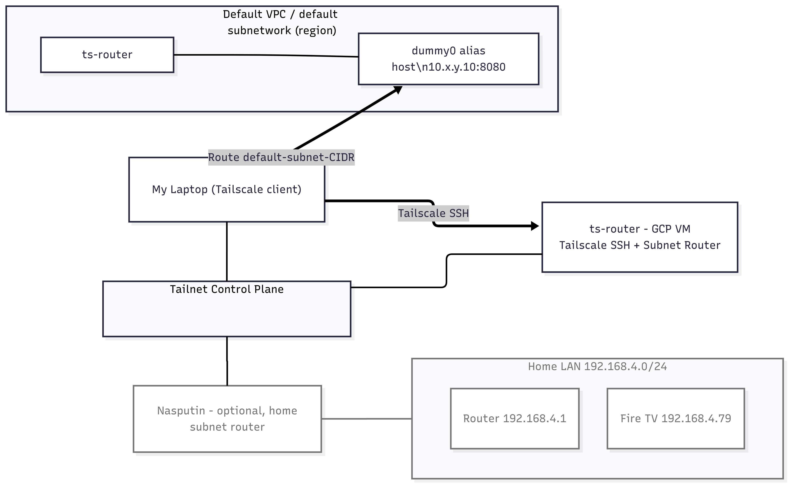

# Tailscale CSE Take-home: Subnet Router + Tailscale SSH on GCP via Terraform

## What this repo demonstrates

1. A personal Tailnet with:
   * One **router VM** that runs Tailscale with SSH enabled.
   * The router VM also acts as a **subnet router** that advertises its VPC subnet to the Tailnet.

2. A **service VM** reachable only via the advertised subnet:
   * The service VM runs a small HTTP endpoint on port 8080 bound to its internal IP.
   * This demonstrates full path: Tailnet → router VM → VPC subnet → service VM.

3. 100 percent Infrastructure as Code using **Terraform**, with 2 startup scripts (router and service).


> Why GCP and not my Mac or Synology:
>
> * Synology DSM does not support Tailscale SSH.
> * The macOS App Store build is sandboxed for SSH, and I did not want to add complexity while remote.
> * A small GCP VM gives a clean, reproducible demo that highlights the product and my troubleshooting approach.

## Architecture

* A MacBook laptop that runs the Tailscale client and joins the Tailnet.
* A **GCP e2-micro** VM named `ts-router`:
  * joins the Tailnet
  * enables **Tailscale SSH**
  * advertises its **VPC subnet** to the Tailnet
  * sets up Linux IP forwarding and NAT for reliable return traffic
* Another **GCP e2-micro** VM named `service-host`:
  * runs inside the same VPC subnet
  * provides a simple HTTP server bound to its internal IP

### Diagram




## Cost safety

* The plan uses **e2-micro** which is covered by Google Cloud Free Tier in certain US regions.
* I checked the eligible regions in the billing console, then I'm making sure to run `terraform destroy` when done.


## Prerequisites

* A GCP project with billing enabled and permissions to create a VM.
* `gcloud` authenticated to my project.
* Terraform installed.
* A Tailscale account and a **Tailscale auth key**. I can use a pre-auth key from the Admin Console.
  For least privilege, I can create a tagged key and apply ACLs, but that is optional for this demo.

## Variables to provide

* `project_id`
* `region` and `zone`
  * Prefer an Always Free eligible US region and matching zone.
  * As I'm in London, UK, I chose the us-east1 region to reduce latency.
* `ts_authkey` (Previously generated)
* `ts_hostname` (default `ts-router`)
* `ts_svc_hostname` (default `service-host`)

## How to deploy

```bash
cd infra/gcp
terraform init
terraform apply
```

When the VM boots, the startup script will:

* install Tailscale
* enable IP forwarding and NAT
* join my Tailnet
* enable **Tailscale SSH**
* advertise the VPC subnet
* bring up a service VM inside that subnet and start a tiny HTTP server bound to it

## Demo flow

1. Make sure the current device is connected to Tailscale

```bash
tailscale status
```

2. SSH into the VM using the Google Cloud Shell, or use:

```bash
gcloud compute ssh --zone "us-east1-b" "ts-router" --project "MY_PROJECT_ID"
```

3. Get the URL to authenticate Tailscale on the Subnet router

Run:

```bash
tailscale status
```

It should show a message like:

```bash
Logged out.
Log in at: https://login.tailscale.com/a/xxxxxxxxxxx
```

**Exit SSH**! The next step will be on the local machine.

3. Approve the route from the console

Open the Tailscale Admin Console and approve the **advertised subnet** from `ts-router`.

4. Reach the private service on the service VM from the local device

Use the curl command in output after the Terraform plan. Something like:

```bash
curl http://10.142.x.x:8080/
```

Just in case, the IP of the service VM will be in the GCP console or by using this command:

```bash
terraform output service_vm_internal_ip
```

If the curl works, we have proven the following routes:

* Tailnet to router VM via Tailscale SSH
* Subnet routing into the VPC
* Private service VM reachable only through the advertised route

5. (optional) Show result with a disapproved subnet

* Disapprove the subnet on the Tailscale console
* Run the curl command

It should time out, which proves the service is behind the Tailscale subnet.

## How to tear down

```bash
terraform destroy
```
