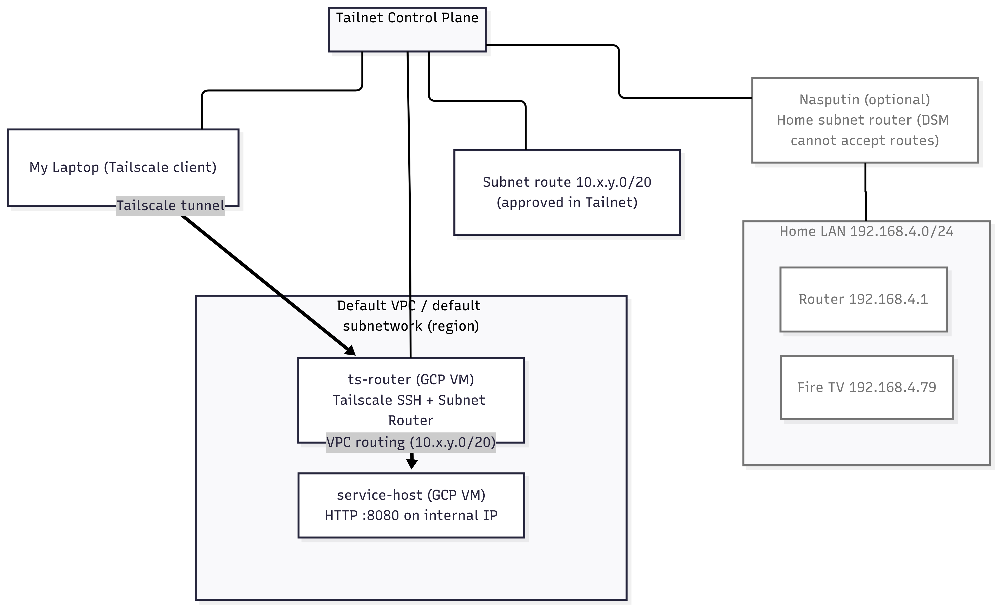

# Tailscale CSE Take-home: Subnet Router + Tailscale SSH on GCP (Terraform)

## What this repo demonstrates

1. A personal Tailnet with:
   * One **GCP VM** that acts as a **Tailscale device with SSH enabled**.
   * The same VM also acts as a **subnet router** that advertises its VPC subnet to the Tailnet.

2. A **private service** reachable only via the advertised subnet:
   * The VM creates a **dummy interface** with an IP inside the VPC CIDR and serves a small HTTP endpoint there.
   * This simulates a private host behind the subnet router without needing a second VM.
3. 100 percent Infrastructure as Code using **Terraform**, plus a single **startup script** on the VM.

> Why GCP and not my Mac or Synology:
>
> * Synology DSM does not support Tailscale SSH.
> * The macOS App Store build is sandboxed for SSH, and I did not want to add complexity while remote.
> * A small GCP VM gives a clean, reproducible demo that highlights the product and my troubleshooting approach.

## Architecture

* A MacBook laptop runs the Tailscale client and joins the Tailnet.
* A single **GCP e2-micro** VM named `ts-router`:
  * joins the Tailnet
  * enables **Tailscale SSH**
  * advertises its **VPC subnet** to the Tailnet
  * sets up Linux IP forwarding and NAT for reliable return traffic
  * creates a dummy IP **inside the VPC CIDR** and binds a tiny HTTP server to it

### Diagram




## Cost safety

* The plan uses **e2-micro** which is typically covered by Google Cloud Free Tier in certain US regions.
* Verify eligible regions in the billing console, then run `terraform destroy` when done.

## Repo structure

```
/
  README.md
  infra/
    gcp/
      main.tf
      variables.tf
      outputs.tf
      scripts/
        startup.sh.tftpl
  diagram/
    architecture.png
```

## Prerequisites

* A GCP project with billing enabled and permissions to create a VM.
* `gcloud` authenticated to my project.
* Terraform installed.
* A Tailscale account and a **Tailscale auth key**. I can use a pre-auth key from the Admin Console.
  For least privilege, I can create a tagged key and apply ACLs, but that is optional for this demo.

## Variables to provide

* `project_id`
* `region` and `zone`
  * Prefer an Always Free eligible US region and matching zone.
  * As I'm in London, UK, I chose the us-east1 region to reduce latency.
* `ts_authkey` (Previously generated)
* Optional: `ts_hostname` (default `ts-router`)

## How to deploy

```bash
cd infra/gcp

# 1) Initialize
terraform init

# 2) Apply
terraform apply
```

When the VM boots, the startup script will:

* install Tailscale
* enable IP forwarding and NAT
* join your Tailnet
* enable **Tailscale SSH**
* advertise the VPC subnet
* bring up a dummy IP inside that subnet and start a tiny HTTP server bound to it

### Approve the route

Open the Tailscale Admin Console and approve the **advertised subnet** from `ts-router`.

## How to test

From the laptop after the route is approved:

1. Confirm the Tailnet view

```bash
tailscale status
```

2. SSH into the VM using Tailscale SSH

```bash
ssh tsadmin@ts-router    # or use the VM's Tailscale DNS name or 100.x.y.z
```

3. Reach the private dummy endpoint behind the subnet router
   The startup script picks a stable IP **inside the VPC subnet** and binds `python3 -m http.server 8080` to it.
   The script prints the chosen IP to `/var/log/ts-router-dummy-ip.log`.

```bash
ssh tsadmin@ts-router "cat /var/log/ts-router-dummy-ip.log"
# Example output: 10.128.0.10

curl http://10.128.0.10:8080/
# You should see the default Python directory listing page.
```

If the curl works, I have proven:

* Tailnet to VM via Tailscale SSH
* Subnet routing into the VPC
* Private service reachable only through the advertised route

## How to tear down

```bash
terraform destroy
```
